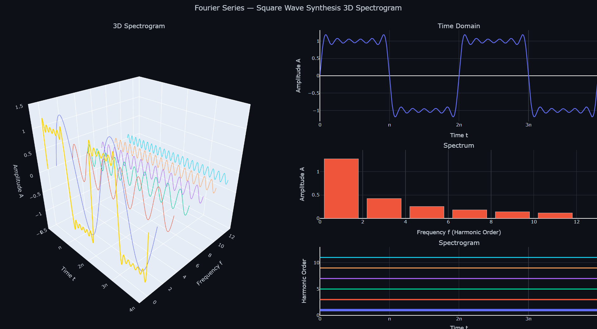
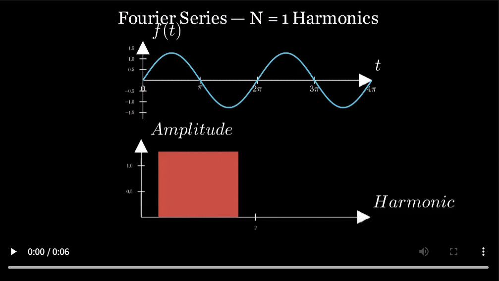
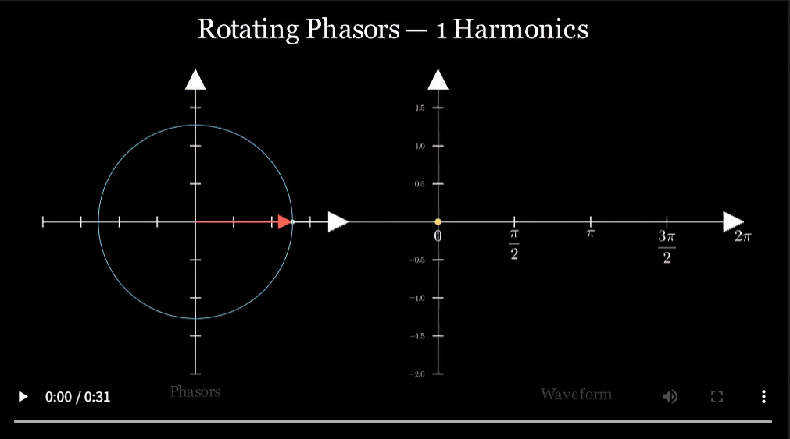

# Fourier Transform Demo

[](LICENSE)
[](https://github.com/YC-CLT/fourier_transform_demo/actions)

[**English**](#english) &nbsp;|&nbsp; [**中文**](#中文)

Visualize square wave synthesis via Fourier series using **Plotly 3D interactive plots** and **Manim animations**.

> **Live Demo:** [YC-CLT.github.io/fourier_transform_demo](https://YC-CLT.github.io/fourier_transform_demo/)

## Demo

<div align="center">

</div>

<table>
<tr>
<td width="50%">

**Scene A — Superposition**

<a href="https://YC-CLT.github.io/fourier_transform_demo/FourierSuperposition.mp4"></a>

</td>
<td width="50%">

**Scene B — Rotating Phasors**

<a href="https://YC-CLT.github.io/fourier_transform_demo/FourierPhasors.mp4"></a>

</td>
</tr>
</table>

---

<h2 id="english">English</h2>

## Setup

```bash
uv sync
```

## Quick Reference

### 3D Interactive Spectrogram

```bash
uv run python fourier_3d/plotly_spectrum.py
```

| Action | How |
|:--|:--|
| Change harmonic count | Number input / ◀ ▶ buttons / ↑↓ keys |
| Play / Pause | Click play button, auto-loop 1→99→1 |
| Switch view | Front (time-domain) / Side (frequency-domain) / Top (spectrogram) |
| 3D rotate / zoom | Mouse drag / scroll |

### Manim Scene A — Superposition

```bash
uv run manim -s fourier_manim/scene_superposition.py FourierSuperposition
```

| Output | Description |
|:--|:--|
| Top axes | Time-domain waveform superposition — more harmonics → closer to square wave |
| Bottom axes | Frequency spectrum bar chart — only odd harmonics have values |
| Keyframes | 1, 5, 9, 15, 25, 39 harmonics |
| Output dir | `media/images/scene_superposition/` |

### Manim Scene B — Rotating Phasors

```bash
uv run manim -s fourier_manim/scene_phasors.py FourierPhasors
```

| Output | Description |
|:--|:--|
| Left axes | Phasor vectors chained end-to-end, each rotating at its own frequency |
| Right axes | Yellow dot traces the synthesized waveform in real time |
| Connector | Solid line from phasor tip → current waveform position |
| Keyframes | 1, 5, 9, 15, 25, 39 harmonics |
| Output dir | `media/images/scene_phasors/` |

### Render Video

```bash
# Scene A video
uv run manim -pql fourier_manim/scene_superposition.py FourierSuperposition

# Scene B video
uv run manim -pql fourier_manim/scene_phasors.py FourierPhasors
```

> `-pql` = preview + quality low (fast preview). Use `-pqh` for high quality. Output in `media/videos/`.

## Project Structure

```bash
fourier_transform_demo
├── fourier_core.py                  # Shared core: Fourier series calculations
├── fourier_3d/
│   ├── plotly_spectrum.py           # 3D interactive spectrogram generator
│   └── spectrum.html                # Output: static HTML
├── fourier_manim/
│   ├── __init__.py
│   ├── scene_superposition.py       # Manim superposition animation
│   └── scene_phasors.py             # Manim rotating phasor animation
├── manim.cfg                        # Manim config (LaTeX disabled)
└── pyproject.toml                   # uv dependency management
```

## Math

The Fourier series expansion of a square wave (odd harmonics only):

$$f(t) = \frac{4}{\pi}\left[\sin(t) + \frac{1}{3}\sin(3t) + \frac{1}{5}\sin(5t) + \frac{1}{7}\sin(7t) + \cdots\right]$$

More harmonics → closer to an ideal square wave. With a finite truncation, the Gibbs phenomenon causes ~9% overshoot near discontinuities.

## Tech Stack

| Component | Version |
|:--|:--|
| Python | 3.11+ |
| Package manager | uv |
| Manim | Community v0.20+ |
| Plotly | 5.18+ |
| NumPy | 1.24+ |
| Formula rendering | MathJax 3 (CDN) |

---

<h2 id="中文">中文</h2>

用 **Plotly 3D 交互图** + **Manim 动画** 两种方式可视化傅里叶级数中方波合成过程。

> **在线演示:** [YC-CLT.github.io/fourier_transform_demo/spectrum.html](https://YC-CLT.github.io/fourier_transform_demo/spectrum.html)

## 环境准备

```bash
uv sync
```

## 命令速查

### 3D 可交互时频谱

```bash
uv run python fourier_3d/plotly_spectrum.py
```

| 操作 | 方式 |
|:--|:--|
| 调节谐波数 | 数字输入框 / ◀ ▶ 按钮 / 键盘 ↑↓ |
| 播放/暂停 | 点击播放按钮，自动循环 1→99→1 |
| 切换视角 | 正面（时域）/ 侧面（频域）/ 顶部（时频图） |
| 3D 旋转/缩放 | 鼠标拖拽 / 滚轮 |

### Manim 场景 A — 叠加合成

```bash
uv run manim -s fourier_manim/scene_superposition.py FourierSuperposition
```

| 输出 | 说明 |
|:--|:--|
| 上轴 | 时域波形叠加，谐波越多越接近方波 |
| 下轴 | 频谱柱状图，仅奇次谐波有值 |
| 关键帧 | 1, 5, 9, 15, 25, 39 次谐波 |
| 输出目录 | `media/images/scene_superposition/` |

### Manim 场景 B — 旋转向量

```bash
uv run manim -s fourier_manim/scene_phasors.py FourierPhasors
```

| 输出 | 说明 |
|:--|:--|
| 左图 | 谐波向量首尾相连，按各自频率旋转 |
| 右图 | 黄色圆点实时描出合成波形 |
| 连接 | 实线连接向量末端 → 波形当前位置 |
| 关键帧 | 1, 5, 9, 15, 25, 39 次谐波 |
| 输出目录 | `media/images/scene_phasors/` |

### 渲染视频

```bash
# 场景 A 视频
uv run manim -pql fourier_manim/scene_superposition.py FourierSuperposition

# 场景 B 视频
uv run manim -pql fourier_manim/scene_phasors.py FourierPhasors
```

> `-pql` = 预览 + 低质量（快速预览），高质量用 `-pqh`，输出在 `media/videos/`。

## 项目结构

```bash
fourier_transform_demo
├── fourier_core.py                  # 共享核心：傅里叶级数计算
├── fourier_3d/
│   ├── plotly_spectrum.py           # 3D 可交互时频谱生成脚本
│   └── spectrum.html                # 输出：纯静态 HTML
├── fourier_manim/
│   ├── __init__.py
│   ├── scene_superposition.py       # Manim 叠加动画
│   └── scene_phasors.py             # Manim 旋转向量动画
├── manim.cfg                        # Manim 配置（禁用 LaTeX）
└── pyproject.toml                   # uv 依赖管理
```

## 数学原理

方波的傅里叶级数展开（仅奇次谐波）：

$$f(t) = \frac{4}{\pi}\left[\sin(t) + \frac{1}{3}\sin(3t) + \frac{1}{5}\sin(5t) + \frac{1}{7}\sin(7t) + \cdots\right]$$

谐波数量越多，合成波形越接近理想方波。在有限项截断时，跳变点附近会出现 Gibbs 现象（约 9% 过冲）。

## 技术栈

| 组件 | 版本 |
|:--|:--|
| Python | 3.11+ |
| 包管理 | uv |
| Manim | Community v0.20+ |
| Plotly | 5.18+ |
| NumPy | 1.24+ |
| 公式渲染 | MathJax 3 (CDN) |
